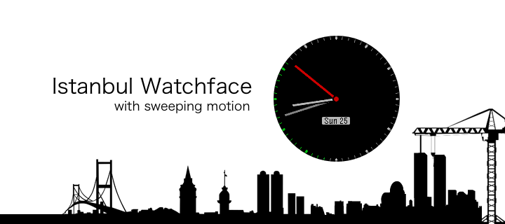

Istanbul is a yet simple watch face which is mainly focused on the second hand animation to provide sweeping motion. To prevent battery drain it starts to animate for a minute then returns back to 12 position within 3 seconds.

Thanks to https://github.com/pebble-examples/ks-clock-face example.
